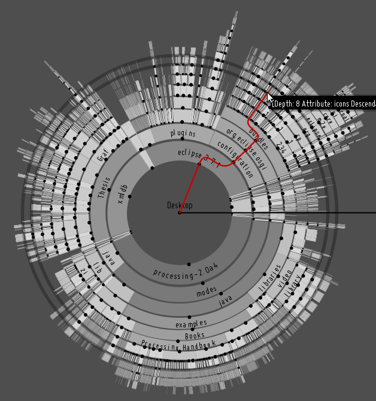
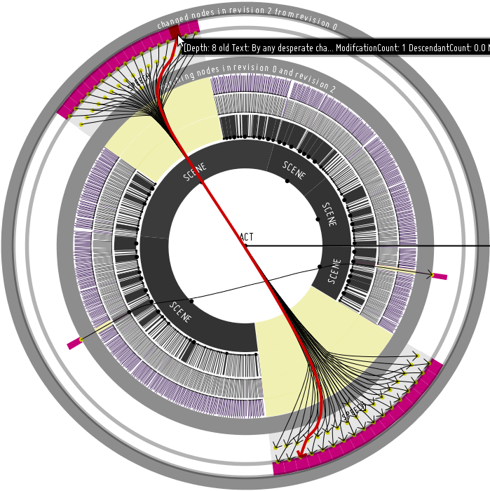

### Introduction
Sirix is a storage system, which brings versioning to a sub-file granular level while taking full advantage of flash based drives as for instance SSDs. As such per revision as well as per page deltas are stored. Time-complexity for retrieval of records/nodes and the storage are logarithmic (`O(log n)`). Space complexity is linear (`O(n)`). Currently, we provide several APIs which are layered. A very low level page-API, which handles the storage and retrieval of records on a per page-fragment level (whereas a buffer manager handles the caching of pages in-memory and the versioning takes place even on a lower layer for storing and reconstructing the page-fragments in CPU-friendly algorithms), a cursor based API to store and navigate through records (currently XML/XDM-nodes as well as JSON-nodes) on top, a DOM-alike node layer for simple in-memory processing of these nodes, which is used by Brackit, a sophisticated XQuery processor. And last but not least a RESTful asynchronous HTTP-API. Our goal is to provide a seamless integration of a native JSON layer besides the XML node layer, that is extending the XQuery Data Model (XDM) with other node types (support for JSONiq through the XQuery processor Brackit). In general, however we could store every kind of data. We provide

1. The current revision of the resource or any subset thereof;
2. The full revision history of the resource or any subset thereof;
3. The full modification history of the resource or any subset thereof.

We not only support all XPath axis (as well as a few more like as for instance a PostOrderAxis) to query a resource in one revision but also novel temporal axis which facilitate navigation in time. A transaction (cursor) on a resource can be started either by specifying a specific revision number (to open a revision/version/snapshot of a resource) or by a given point in time. The latter starts a transaction on the revision number which was committed closest to the given timestamp.

{: style="max-width: 450px; height: auto;"} {: style="max-width: 450px; height: auto;"}

### API documentation
We provide several APIs to interact with Sirix.

1. The [transactional cursor API](/transactional-cursor-api.html) is a powerful low-level API.
2. On top of this API we built a [Brackit.org](http://brackit.org) binding to provide the ability to use Sirix with a more [DOM-alike API](/dom-alike-api.html) with in-memory nodes and an [XQuery API](/xml-xquery-api.html).
3. We provide a powerful, asynchronous, non-blocking [RESTful-API](/rest-api.html) to interact with a Sirix HTTP-server. Authorization is done via Keycloak.  
